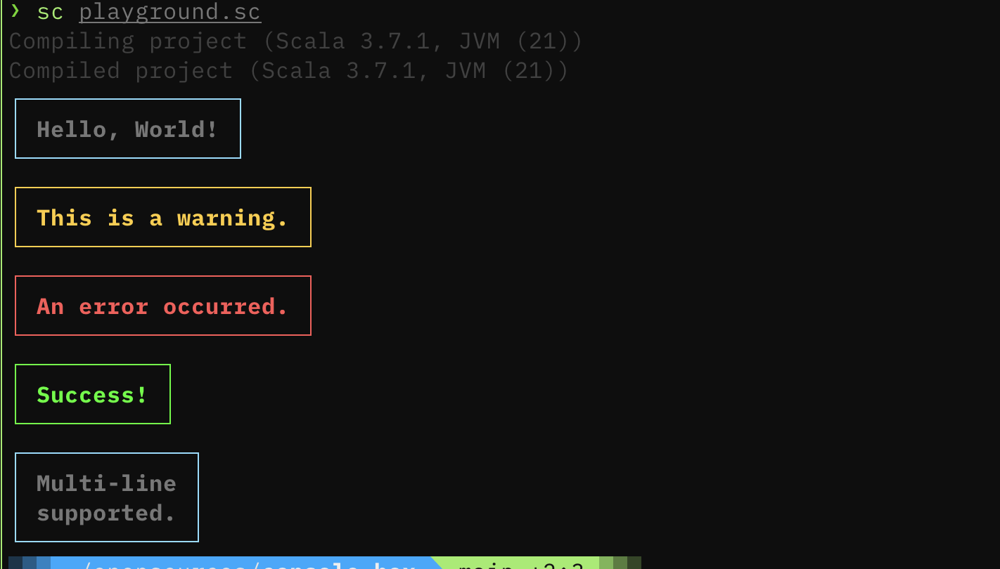

# ConsoleBox

A simple terminal box/logging utility for Scala.


## Install

**sbt:**

```scala
libraryDependencies += "com.w47s0n" %% "consolebox" % "0.1.2"
```

**mill:**

```scala
def ivyDeps = Agg(
  ivy"com.w47s0n::consolebox:0.1.2"
)
```

Cross-built for Scala 2.12.x, 2.13 & 3.x

## Usage

```scala
import com.w47s0n.ConsoleBox
import com.w47s0n.ConsoleBox.LogLevel._

println(ConsoleBox.print("Hello, World!", Info))
println(ConsoleBox.print("This is a warning.", Warning))
println(ConsoleBox.print("An error occurred.", Error))
println(ConsoleBox.print("Success!", Success))
println(ConsoleBox.print("Multi-line\nsupported.", Info))
```

## License

MIT
